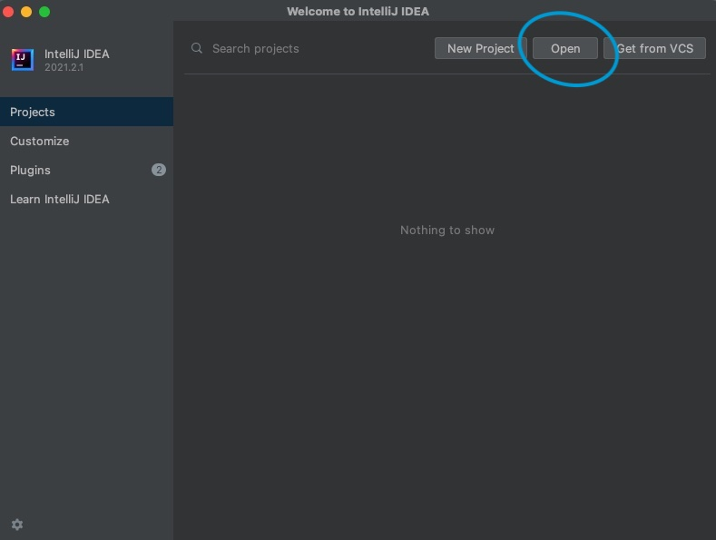

# Getting Started

## Logistics

This assignment is due **Thursday, 9/5/2024 at 11:59PM PDT (GMT-7)**. It is worth 0% of your overall grade, but failure to complete it may result in being **administratively dropped from the class**.

## Prerequisites

No lectures are required to work through this assignment.

## `git` and GitHub

[git](https://en.wikipedia.org/wiki/Git) is a _version control_ system, that helps developers like you track different versions of your code, synchronize them across different machines, and collaborate with others. If you don't already have git on your machine you can follow the instructions [here ](https://git-scm.com/book/en/v2/Getting-Started-Installing-Git)to install it.

[GitHub](https://github.com) is a site which supports this system, hosting it as a service. In order to get a copies of the skeleton code to work on during the semester you'll need to create an account.

We will be using git and GitHub to pass out assignments in this course. If you don't know much about git, that isn't a problem: you will _need_ to use it only in very simple ways that we will show you in order to keep up with class assignments.

If you'd like to use git for managing your own code versioning, there are many guides to using git online -- [this](http://git-scm.com/book/en/v1/Getting-Started) is a good one.

### Fetching the released code

For each project, we will provide a GitHub Classroom link. Follow the link to create a GitHub repository with the starter code for the project you are working on. Use `git clone` to get a local copy of the newly created repository. For example, if your GitHub username is `oski` after being assigned your repo through GitHub Classroom you would run:

`git clone https://github.com/cs186-student/fa24-proj0-oski`

The GitHub Classroom link for this project is provided in the project release post on [Edstem](https://edstem.org/us/courses/62108/discussion/).

### Debugging Issues with GitHub Classroom

Feel free to skip this section if you don't have any issues with GitHub Classroom. If you are having issues (i.e. the page froze or some error message appeared), first check if you have access to your repo at `https://github.com/cs186-student/fa24-proj0-username`, replacing `username` with your GitHub username. If you have access to your repo and the starter code is there, then you can proceed as usual.

#### 404 Not Found

If you're getting a 404 not found page when trying to access your repo, make sure you've set up your repo using the GitHub Classroom link in the Project 0 release post on [Edstem](https://edstem.org/us/courses/62108/discussion/).

If you don't have access to your repo at all after following these steps, feel free to contact the course staff on Edstem.

## Setting up your local development environment

You are free to use any text editor or IDE to complete the assignments, but **we will build and test your code in a Docker container with Maven**.

We recommend setting up a local development environment by installing Java 11 locally (the version our Docker container runs) and using an IDE such as IntelliJ. (*Please make sure you have at least Intellij 2019 version, some of the issues from previous semesters are from a too old Intellij*)

[Java 11 downloads](https://www.oracle.com/java/technologies/downloads/#java11) (or alternatively, you're free to use [OpenJDK](https://openjdk.java.net/install/))

To import the project into IntelliJ, click `Open`, and select the `pom.xml` file when importing. `pom.xml` is what stores the configuration and dependencies you need for the project. Once it is scanned, Maven will use the information in it to build the project for you!

If launching IntelliJ takes you to an existing workspace instead of showing you the popup above you can open the project by navigating to `File -> New -> Project From Existing Sources` and then select the `pom.xml` file and click "OK". "Trust" the project if you are prompted.

If you previously had used other versions of Java to build project, you can change to Java 11 by `File -> Project Structure... -> Change Project SDK to the one you want to use`.

### Running tests in IntelliJ

If you are using IntelliJ and wish to run the tests for a given assignment follow the instructions below.

1. Navigate to one of the test files for the project. For example, for Project 2 navigate to src/java/test/.../index/TestBPlusNode.java.&#x20;
2. Navigate to one of the tests (as shown below). Click on the green arrow and run the test (it should fail).

If the green arrow does not appear or you're unable to run the test, follow the steps below.

1. &#x20;Open up Run/Debug Configurations with Run > Edit Configurations.
2. Click the + button in the top left to create a new configuration, and choose JUnit from the dropdown. Fill in the configurations as shown below and click ok. Make sure to click Modify Options > Search for tests > In whole project.

You should now see Project 2 tests in the dropdown in the top right. You can run/debug this configuration to run all the Project 2 tests.

*If for some reason you still cannot run the tests, it's likely that you had one of the steps above wrong. At this time, the best thing to do is to re-clone the project and go through the setting up again. Some students may try re-importing the `pom.xml` file, but there could be some configuration being polluted, so the safest option is to re-clone the project and import the `pom.xml` file again.*

Once you have a copy of the released code, head to the next section "Your Tasks" and begin working on the assignment.
