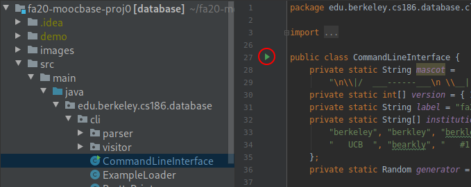

# Your Tasks

For this assignment you will get acquainted with running RookieDB's command line interface and make a small change to one file to get things working properly.

## Task 1: Running the CLI

Most databases provide a command line interface (CLI) to send and view the results of queries. To run the CLI in IntelliJ navigate to the file:

`src/main/java/edu/berkeley/cs186/database/cli/CommandLineInterface`

It's okay if you don't understand most of the code here right now, we just want to run it. Locate the arrow next to the class declaration click on it to start the CLI.

*Note: If you see the warning*
```java
Required type: List <edu.berkeley.cs186.database.table.Record>
Provided: List <Record>
```
*It is because you are using a very new version of Java. If you find it concerning to see the red line in Intellij, follow the steps in the previous page to change the Java SDK*



This should open a new panel in IntelliJ resembling the following image:

 (1) (1).png>)

Click on this panel and try typing in the following query and hitting enter:

`SELECT * FROM Courses LIMIT 5;`

You should get something similar to the following output:

.png>)

Hmm, that doesn't look quite right! Follow the instructions in the next task to get the proper output. To exit the CLI just type in `exit` and hit enter.

## Task 2: Welcome to CS186!

Open up `src/main/java/edu/berkeley/cs186/database/databox/StringDataBox.java`. It's okay if you do not understand most of the code right now.

The `toString` method currently looks like:

```java
    @Override
    public String toString() {
        // TODO(proj0): replace the following line with `return s;`
        return "FIX ME";
    }
```

Follow the instructions in the `TODO(proj0)` comment to fix the return statement.

Navigate to`src/test/java/edu/berkeley/cs186/database/databox/TestWelcome.java` and try running the test in the file, which should now be passing. Now you can run through Task 1 again to see what the proper output should be.

(If you see anything highlighted in red in the test file, its likely that JUnit wasn't automatically added to the classpath. If this is the case, find the first failed import and hover over the portion marked in red. This should bring up a tooltip with the option "Add JUnit to classpath". Select this option. Afterwards, no errors should appear in the file.)

## Task 3: Debugging Exercise

In this course, a majority of the projects are written in Java and involve modifying a large codebase. Knowing how to effectively utilize the IntelliJ debugger will be important in identifying errors with your code. Let's cover the basics of using the IntelliJ debugger!


As you follow along with the steps below, please submit your answers to this [Gradescope assignment](https://www.gradescope.com/courses/816103/assignments/4835357). You must complete this for full credit.


Let's start by navigating to src/test/java/.../index/TestBPlusNode.java.&#x20;

#### Breakpoints

Place a breakpoint as shown below. Breakpoints allow you to select locations in your code where you want the debugger to pause.&#x20;


#### Running the debugger

Select the green arrow next to the function header for testFromBytes. In the dropdown menu, click debug. This will open a debugging console at the bottom. The code is currently paused at the line we placed a breakpoint on.


#### Inspecting variables



Question 1: What is the current size of 'leafKeys'?


#### Step into

Click on the button shown below to step into the LeafNode constructor.


#### Step over

Click on the button shown below to step forward one line.



Question 2: What is the current size of 'rids'?


#### Resume execution

This button allows you to resume execution of your program until it reaches another breakpoint. Don't worry if testFromBytes fails after resuming execution. You won't pass this test until project 2.


## You're done!

Follow the instructions in the next section "Submitting the Assignment" to turn in your work.
