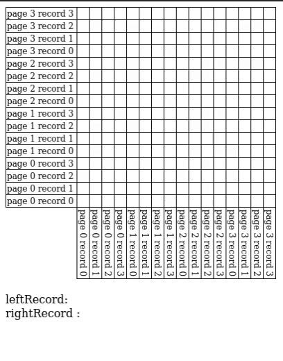
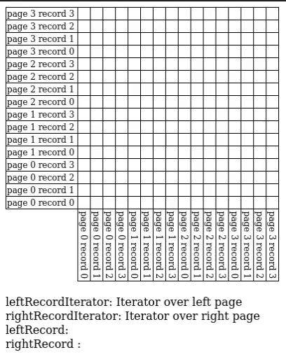
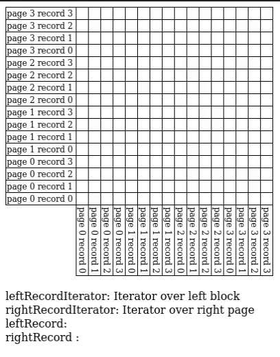

# Nested Loop Join Animations

**Key**

* Records highlighted in blue belong to a page in the left relation that is loaded into memory.
* Records highlighted in orange belong to a page in the right relation that is loaded into memory. 
* The dark blue and dark orange records are the two records currently being compared to see if they fit the join criteria. 
* The purple squares represent which pairs of records have already been considered. 

Notice that regardless of the nested loop join implementation, by the time we finish we've considered every pair of records!

## Normal Speed

### Simple Nested Loop Join

### Page Nested Loop Join

### Block Nested Loop Join \(B=4\)

## x2 Speed

### Simple Nested Loop Join

### Page Nested Loop Join

### Block Nested Loop Join \(B=4\)

